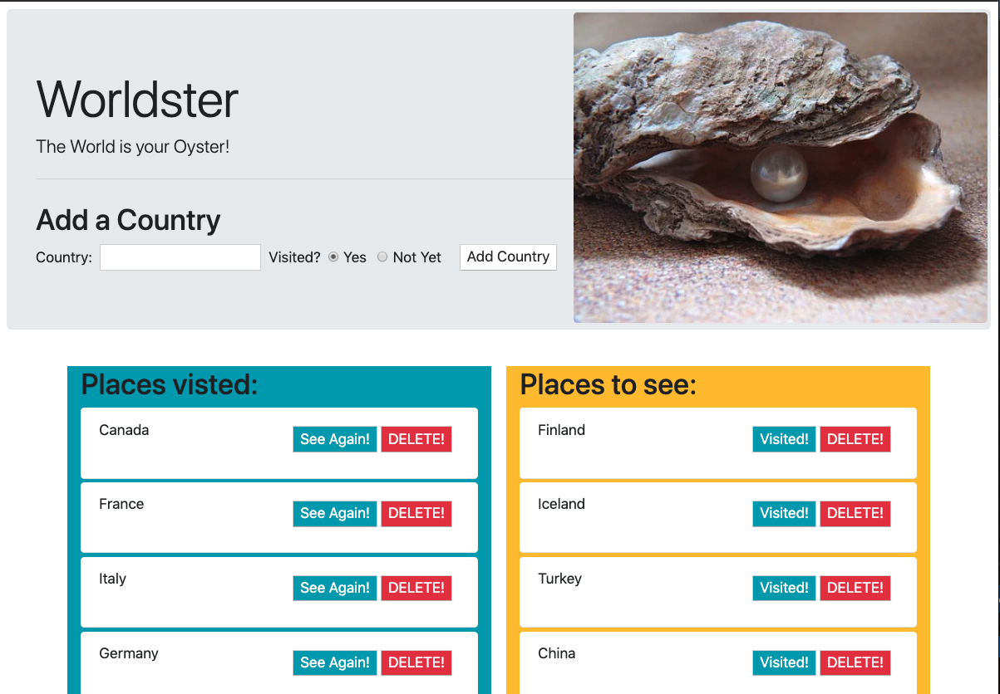

# Worldster

## "The World is your Oyster!"

This application allows users to track the countries they have visited and would like to visit in a database. Users can add new counties as either visited or not visited. Once created they can then check off places they want to see as visited and vice versa. Countries may also be deleted from the list.



## Technologies:

- MySQL
- Node
- Express
- Handlebars
- Javascript


## How to Update Data using Custom ORM

This function is used for updating the visited status of a country.

```
updateOne: function (table, objColVals, condition, cb) {
        var queryString = "UPDATE " + table;

        queryString += " SET " + objToSql(objColVals);
        queryString += " WHERE " + condition;

        connection.query(queryString, function (err, result) {
            if (err) {
                throw err;
            }
            cb(result);
        })
    },

```

## How to Add HTML using Handlebars
This code is used to generate country blocks. The visited button will change depedning on whether visited is true. 
```
<li class="list-group-item rounded mb-1">
	{{country_name}}

	<div class="float-right p-2 mb-2">
		<button class="change-visited bg-info text-white" data-id="{{id}}" data-newvisited="{{newVisited}}">
			{{#if visited}}See Again!{{else}}Visited!{{/if}}
		</button>

		<button class="delete-country bg-danger text-white" data-id="{{id}}">DELETE!</button>
	</div>
	
</li>
```

### Installation:

```
npm install
```

### Usage:


```
node index.js
```

### Demo of add, update and delete:


## Author

Nadine Bundschuh

- Github: nadineb1160
- [GitHub URL](https://github.com/nadineb1160)
- [LinkedIn](https://www.linkedin.com/in/nadine-bundschuh-731233b9)
